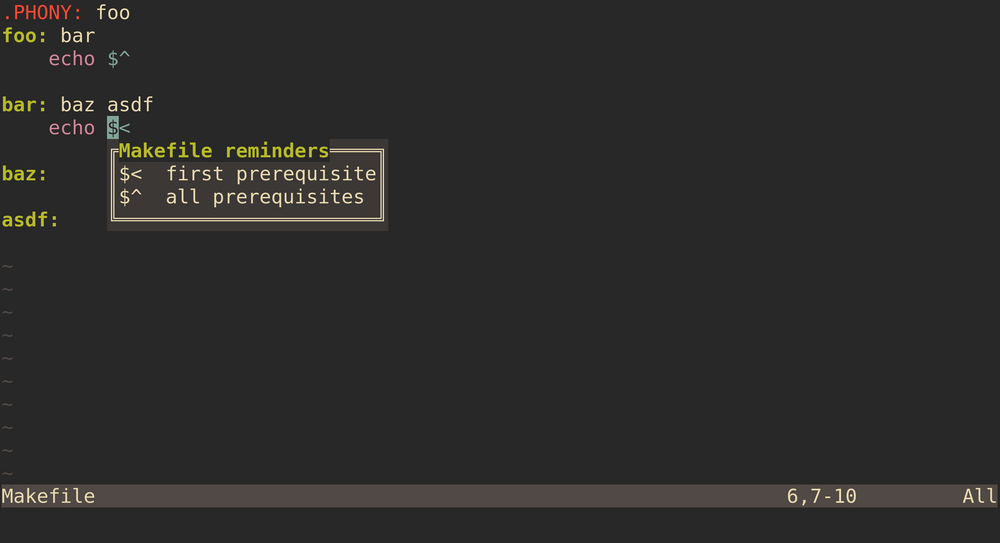

# vim-cheatsheet

A Vim/Neovim plugin that toggles a popup window with custom content that you set for the buffer.

Motivating use case: forgetting whether `$<` or `$^` is the variable that contains all prerequisites of a recipe in a [Makefile](https://www.gnu.org/software/make/manual/html_node/Introduction.html).
With vim-cheatsheet, I can toggle a reminder when I am editing a Makefile:

```vim
autocmd FileType make
            \ let b:cheatsheet_title = "Makefile reminders" |
            \ let b:cheatsheet_lines = [
            \   "$<  first requirement",
            \   "$^  all requirements",
            \ ]
```



By default, the toggle switch is mapped to `<Leader>C`.
You can override this by setting `g:cheatsheet_no_mappings`:

```vim
let g:cheatsheet_no_mappings = v:true

" Bind the toggle to `g?` instead:
nmap <silent> g? <Plug>ToggleCheatsheet
```

## Installation

Use your Vim package manager, or install it manually in Vim:

```
$ mkdir -p ~/.vim/pack/gn0/start
$ cd ~/.vim/pack/gn0/start
$ git clone https://github.com/gn0/vim-cheatsheet.git
$ vim -u NONE -c "helptags vim-cheatsheet/doc" -c q
```

Or in Neovim:

```
$ mkdir -p ~/.config/nvim/pack/gn0/start
$ cd ~/.config/nvim/pack/gn0/start
$ git clone https://github.com/gn0/vim-cheatsheet.git
$ vim -u NONE -c "helptags vim-cheatsheet/doc" -c q
```

## License

vim-cheatsheet is distributed under [CC0](https://creativecommons.org/public-domain/cc0/).

